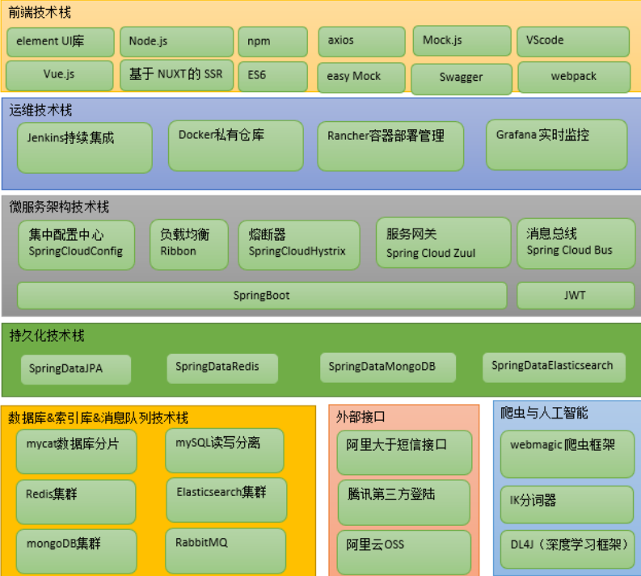

# 简介

 	　十次方社交项目整体分为 **微服务**、**网站前台**、**网站管理后台** 三大部分。功能模块包括头条、问答、招聘、活 动、吐槽、交友、用户中心、搜索中心及第三方登陆等。 

> **Ref**：[视频合辑](https://www.bilibili.com/video/BV1P4411S79a)


## 1 技术架构

​	　项目采用目前主流的微服务系统架构 `SpringBoot`+`SpringCloud`+`SpringData`进行开发，前端技术采用Vue.js，同时也融合了Docker容器化部署、第三方登陆、人工智能、爬虫、RabbitMQ等技术 。




## 2 系统设计

### 2.1 模块划分

```
tensquare_common：公共模块 
tensquare_article：文章微服务 
tensquare_base：基础微服务 
tensquare_friend:交友微服务 
tensquare_gathering：活动微服务 
tensquare_qa：问答微服务 
tensquare_recruit：招聘微服务 
tensquare_user：用户微服务 
tensquare_spit：吐槽微服务 
tensquare_search：搜索微服务 
tensquare_web：前台微服务网关 
tensquare_manager：后台微服务网关 
tensquare_eureka：注册中心 
tensquare_config：配置中心 
tensquare_sms：短信微服务 
tensquare_article_crawler：文章爬虫微服务 
tensquare_user_crawler：用户爬虫微服务 
tensquare_ai：人工智能微服务 

```


### 2.2 表结构分析

​	　tensquare采用的分库分表设计，每个业务模块为1个独立的数据库。 建表SQL在resource/sql中。

```
tensquare_article 文章
tensquare_base 基础 
tensquare_friend 交友 
tensquare_gathering 活动 
tensquare_qa 问答 
tensquare_recruit 招聘 
tensquare_user 用户 
tensquare_spit 吐槽 
```


### 2.3 API文档

​	　课程提供了前后端开发接口文档（采用Swagger语言进行编写），并与Ngin进行了整合。双击Nginx执行文件启动后，在地址栏输入http://localhost:801 即可访问API文档 

要求：接口必须要符合RESTful规范


# 参考资料